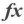

###### Hoop Testing
___
Project>[Servers](../../../../Servers.md)>[Local_Development](../../../Local_Development.md)>[Databases](../../Databases.md)>[data_db](../data_db.md)>[Procedures](Procedures.md)>selectTest


#  selectTest

## <a name="#Description"></a>Description
> 
## <a name="#Properties"></a>Properties
|Name|Value|
|---|---|
|SQL Access|CONTAINS SQL|
|Deterministic|True|
|Security|Definer|
|Definer|root|
|SQL Mode|NO_AUTO_VALUE_ON_ZERO|
|Language|SQL|
|Created|11/6/2024 11:05:27|
|Last Modified|11/6/2024 11:05:27|


## <a name="#Parameters"></a>Parameters
|Name|Data Type|Length|Precision|Scale|
|---|---|---|---|---|
|idSpecimen|INT||11||

## <a name="#SqlScript"></a>SQL Script
```SQL
CREATE
DEFINER = 'root'
PROCEDURE selectTest (IN idSpecimen int UNSIGNED)
DETERMINISTIC
BEGIN

  SELECT
    (selectTestSample(sa.id)) AS 'mySample',
    (selectTestSpecimen(se.id)) AS 'mySpecimen'
  FROM specimen se
    INNER JOIN sample sa
      ON se.sample = sa.id
  WHERE se.id = idSpecimen;

END
```

## <a name="#DependsOn"></a>Depends On _`5`_
-  [reportGenerator@%](../../../Users/reportGenerator@%.md)
-  [selectTestSample](../Functions/selectTestSample.md)
-  [selectTestSpecimen](../Functions/selectTestSpecimen.md)
-  [specimen](../Tables/specimen.md)
-  [sample](../Tables/sample.md)


## <a name="#UsedBy"></a>Used By
No items found

||||
|---|---|---|
|Author: Ezequiel Augusto Stanganelli|Copyright © All Rights Reserved|Created: 26/06/2024|